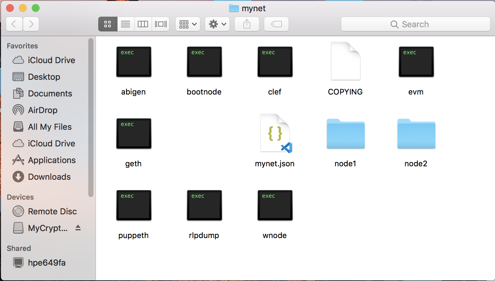
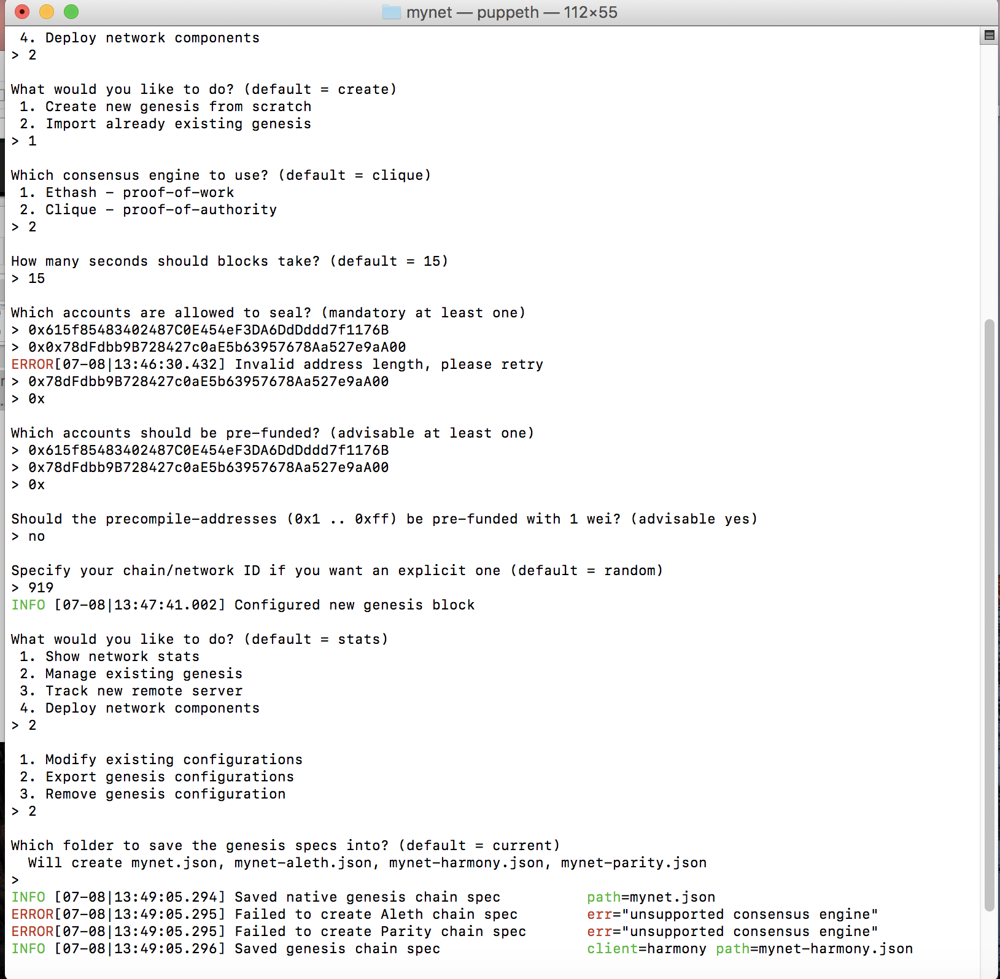
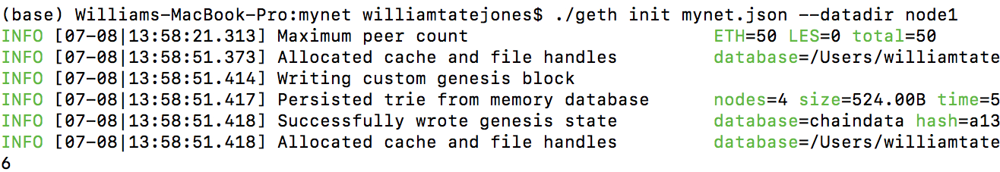
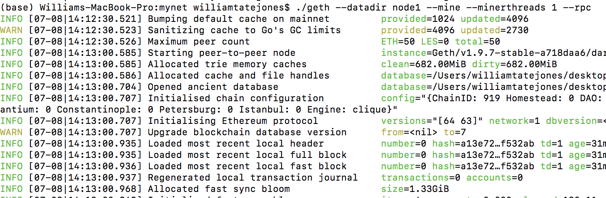
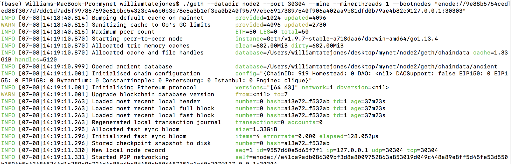
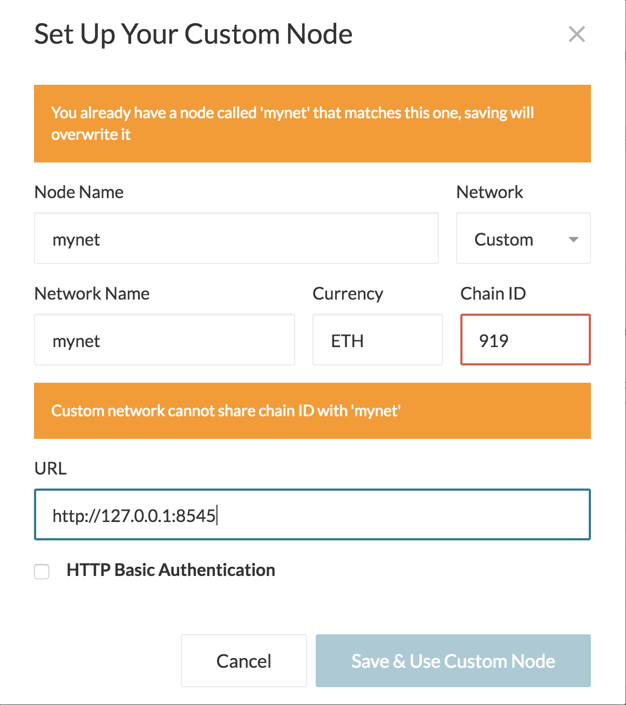
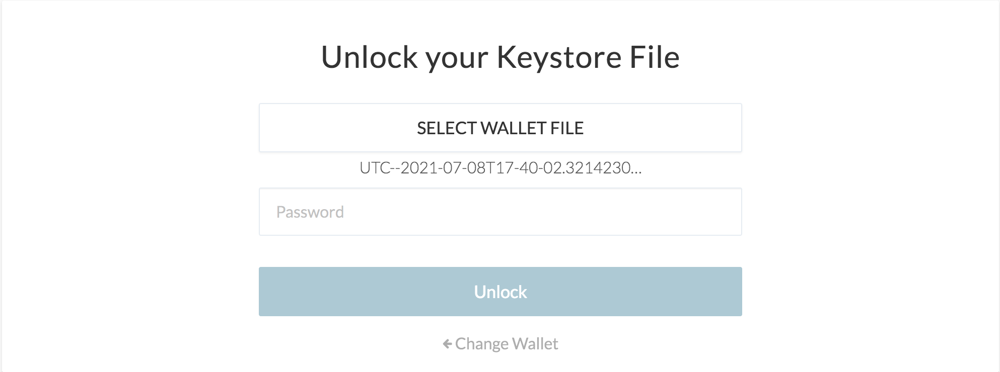
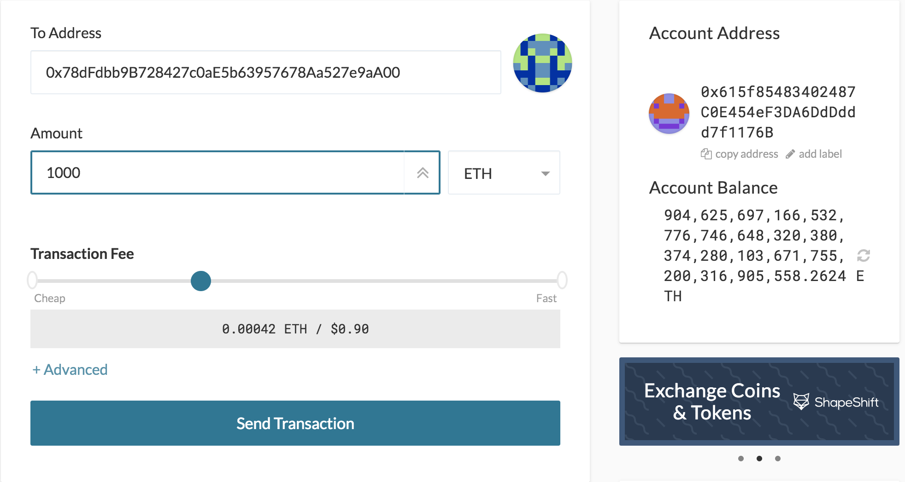
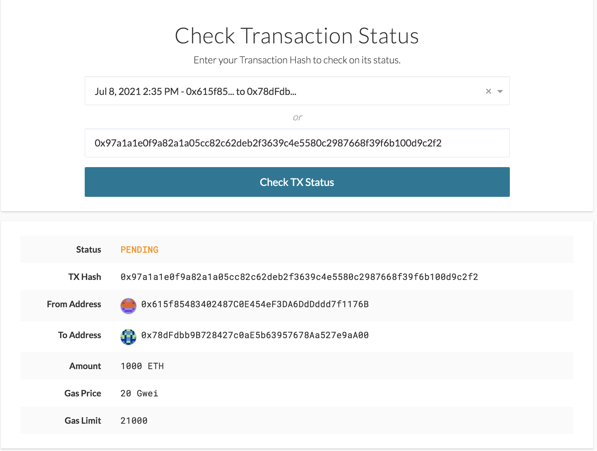

# Creating the Block Chain
## Purpose:
Zbank has commissioned me to lead a project on creating a private testnet to explore the potentials for blockchain within the organization.  This report will show the step by step measures used to create the testnet within the organizations local drives.

## Creating Genesis and Nodes:
To begin the project the first step was to create the genesis block (the first block in the chain) and the nodes (the infrastructure of the blockchain).  To accomplish this I used the blockcahin tools puppeth and geth to create both the genesis and nodes respectively thus creating the network called "mynet". 

When creating the genesis block I chose the the 'Proof of Authority' (POA) consesus algorithm which gives a designated number of blockchain actors the power to validate transactions or interactions within "mynet".  When creating the consesus algorithm I sealed the two nodes and prefunded them so they can be ran and tested on the "mynet".

Finally both nodes were initialized into "mynet" using geth.

## Starting the Blockchain:

Now that the chain's engineering is complete the next step was to enable "mynet" to run.  To launch the first node into mining mode and configured enabled RPC which will allow it work in apps such as MyCrypto.

To enable the second node into the chain I again used geth but created the port number 30304 (the next port number in the chain) and attached it to the first node using bootnodes and node 1's enode.  I also configured node 2 with the ability to mine.

## Testing "Mynet" Transactions

With the network live and mining the final step is to test "mynet" and see its ability to send transactions between nodes.  To do so I used MyCrypto to add the "mynet" netowrk having it connect through the local url.

Next I unlocked the wallet using the node 1's keystore.  Node one was used because it was RPC enabled

After unlocking the wallet it is time to test the transactions.  As a test 1000 ETH were sent from node 1's address to node 2's adress. 

The hash number was then used to check the transaction.

The transaction was a success!  The network is working smoothly as shown by the transaction status 